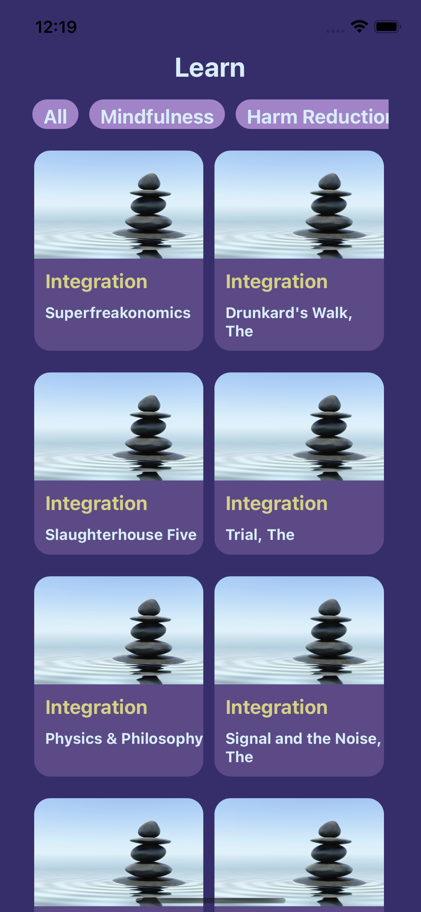
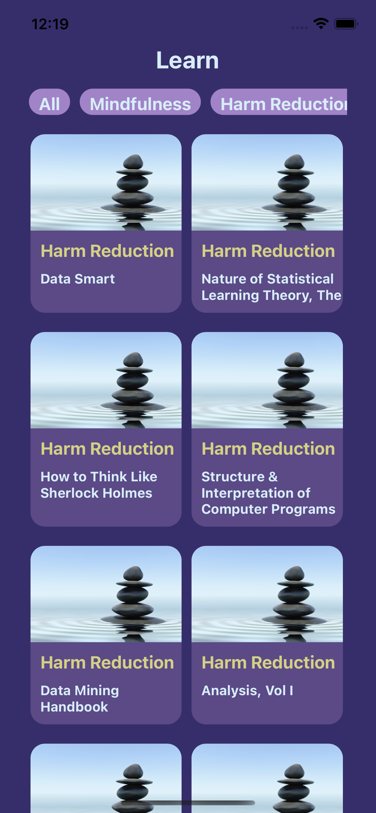
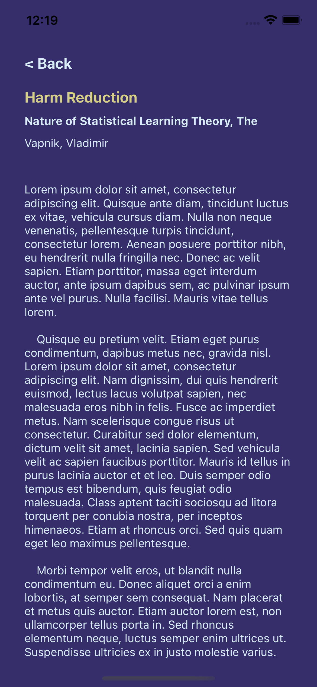

This is a [React Native](https://nextjs.org/) project bootstrapped with [`npx react-native init`](https://reactnative.dev/docs/environment-setup).

## Getting Started

First, install the dependencies:

```bash
npm run install
# or
yarn
```

Second, run the app in which device you prefer, you can find the Android and iOS setup instructions [here]('https://reactnative.dev/docs/environment-setup').

```bash
npm run ios / yarn ios
# or
npm run android / yarn android
```

## Preview





## Tools

- React Native
- React Navigation
- Graphql
- Apollo

## Notes

- Tested only on iOS platform.
